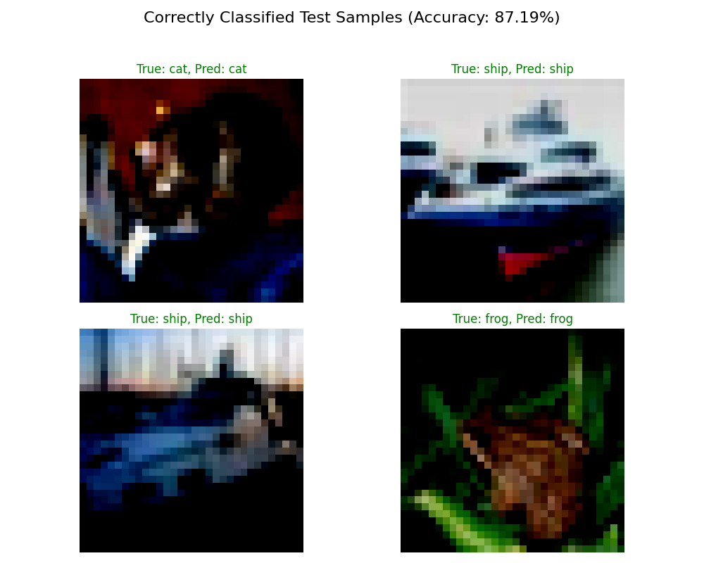
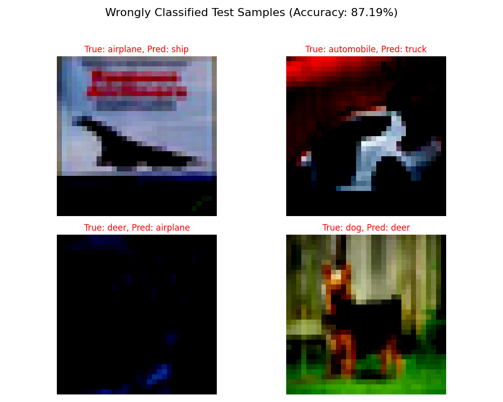

# CIFAR-10 CNN Classifier
Basic Image classifier trained on CIFAR-10 for practice
Trained on local machine, only CPU for 10 epochs. No data augmentation or dropout.
Architecture was used from https://www.kaggle.com/code/shadabhussain/cifar-10-cnn-using-pytorch.

Find training curve as well as additional metrics below.

Correct example predictions

Wrongly classified predictions

Confusion Matrix

